# prescripto
A full-stack doctor appointment booking web app built with the MERN stack (MongoDB, Express, React, Node.js). Includes separate admin and doctor dashboards for seamless management.

---
## Screenshots

### User Panel

#### Home Page
<p align="center">
  
</p>

#### All Doctors
<p align="center">
  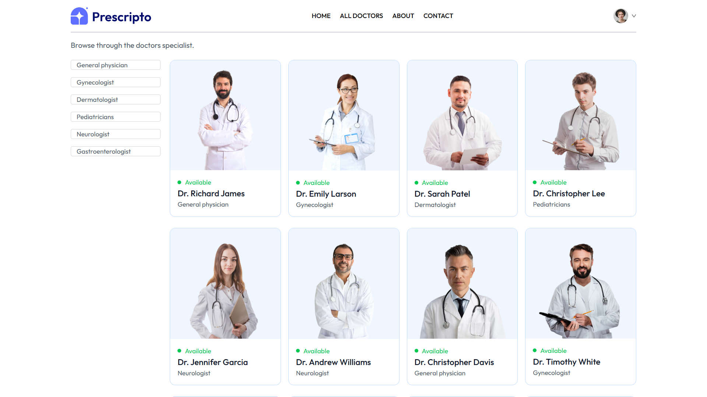
</p>

#### Doctor Details
<p align="center">
  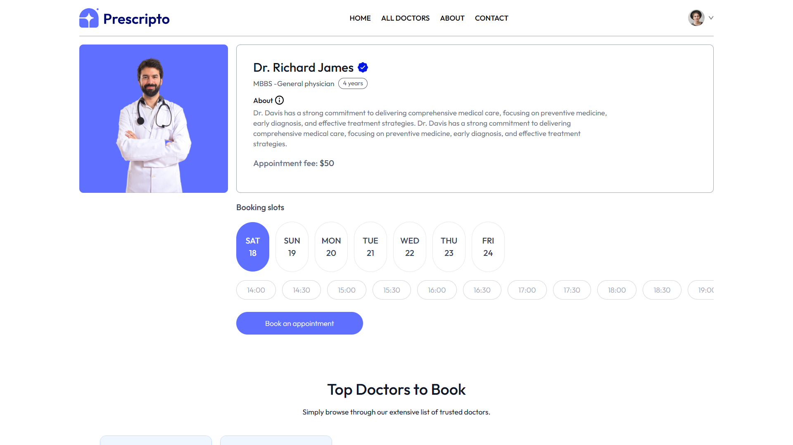
</p>

#### Appointment Page
<p align="center">
  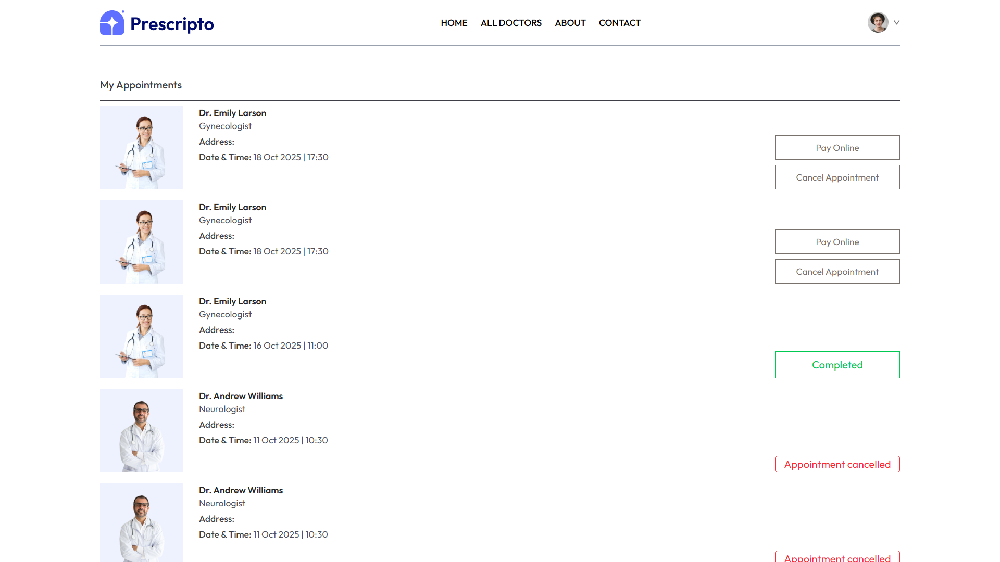
</p>

#### Payment Page
<p align="center">
  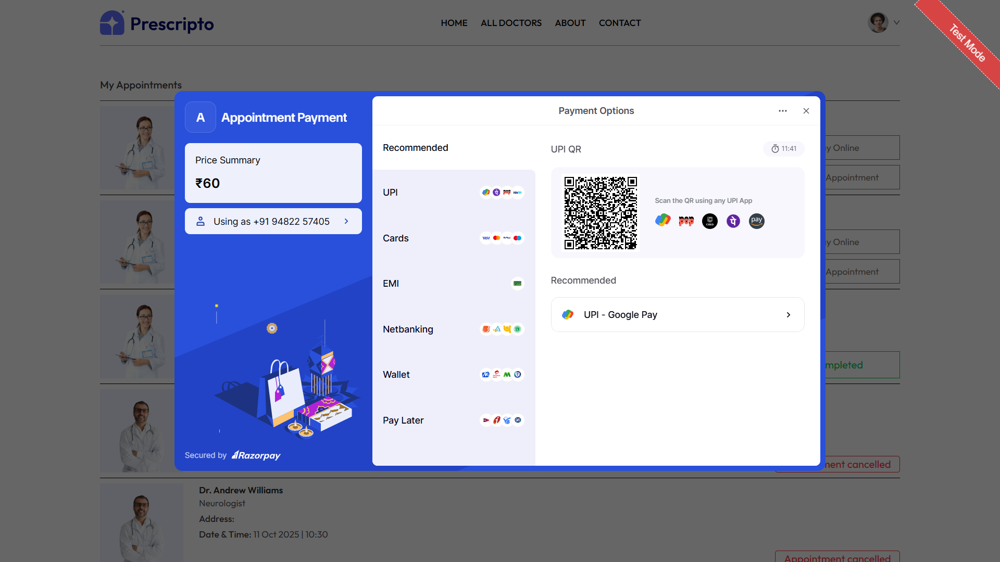
</p>

#### Profile Page
<p align="center">
  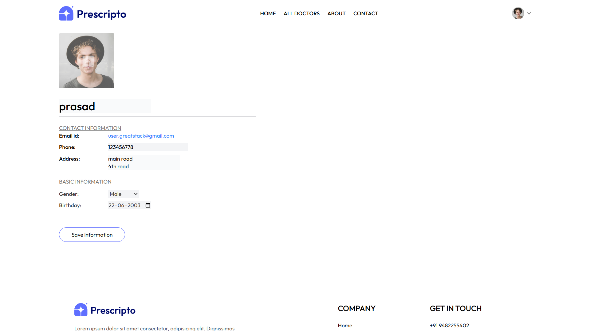
</p>

#### Login Page
<p align="center">
  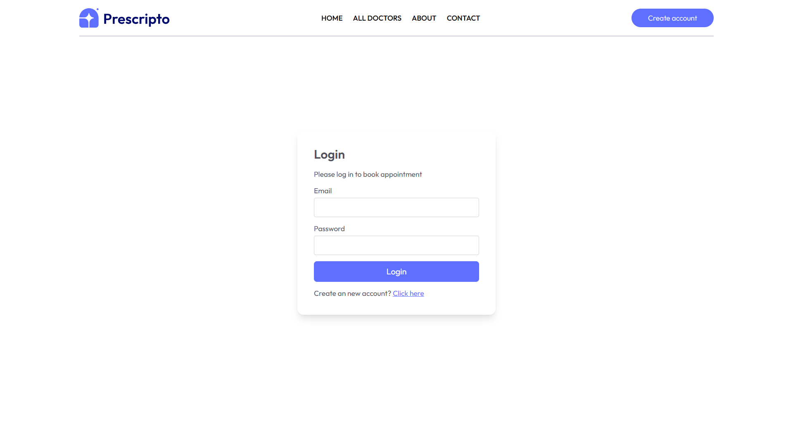
</p>

#### Signup Page
<p align="center">
  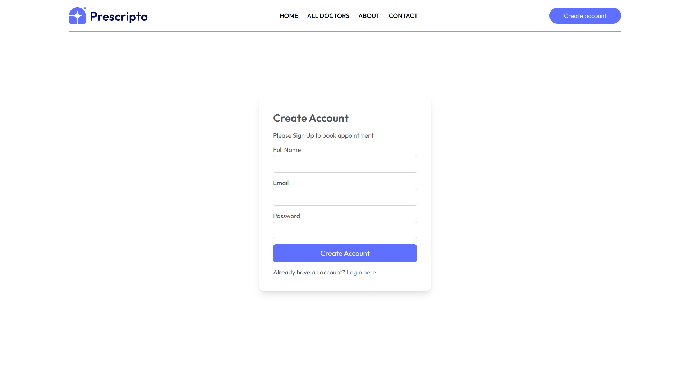
</p>


### Doctor Panel

#### Doctor Login
<p align="center">
  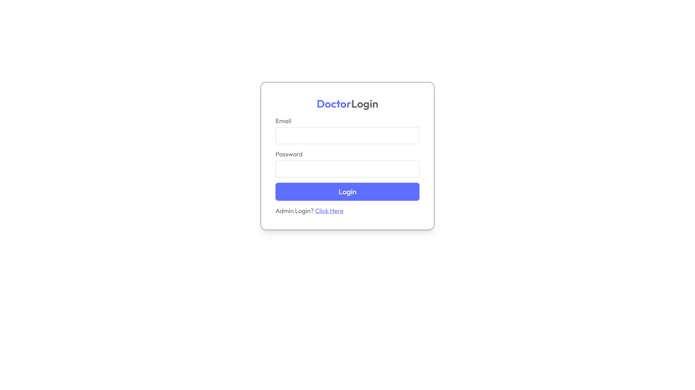
</p>

#### Doctor Dashboard
<p align="center">
  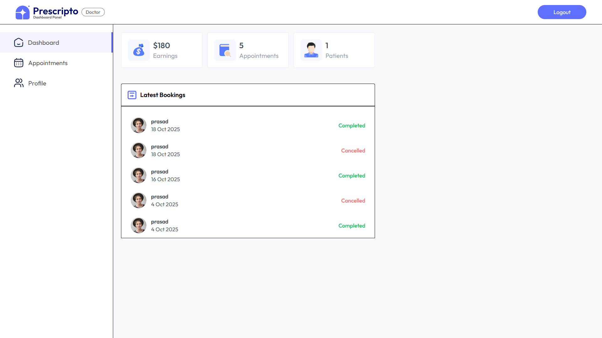
</p>

#### Appointments
<p align="center">
  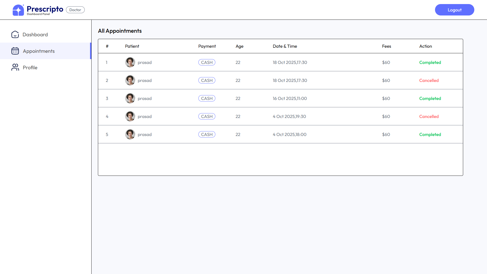
</p>


### Admin Panel

#### Admin Login
<p align="center">
  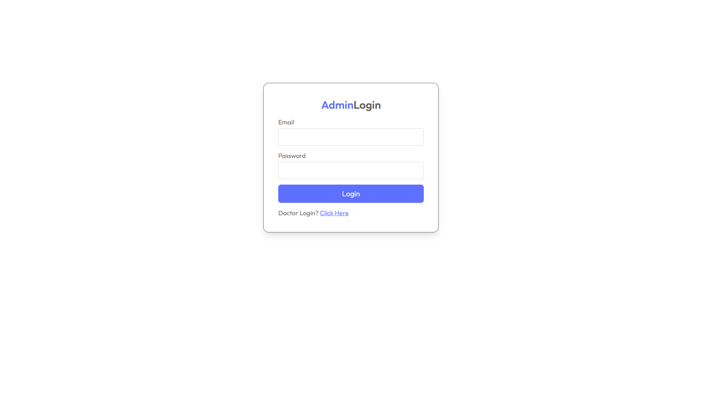
</p>

#### Admin Dashboard
<p align="center">
  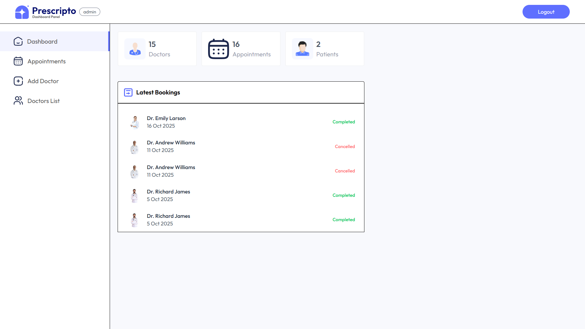
</p>

#### Add Doctor
<p align="center">
  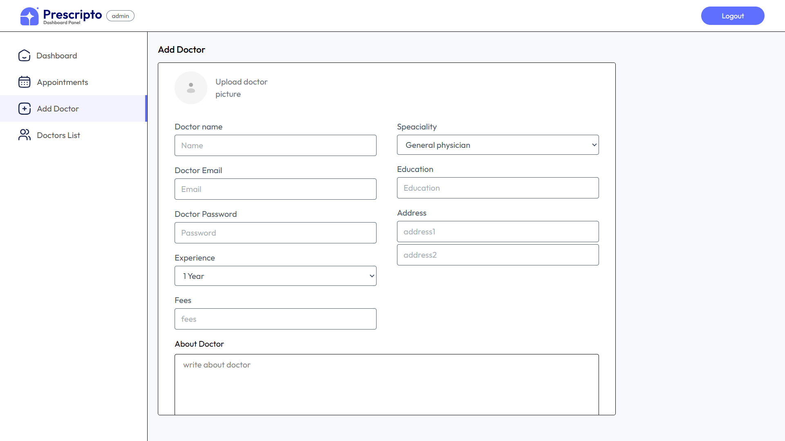
</p>

#### Manage Appointments
<p align="center">
  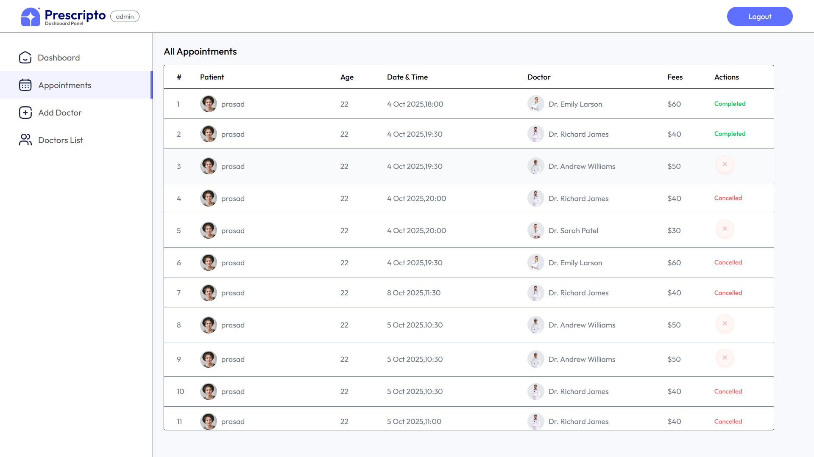
</p>


## About the Project

Prescripto is a full-stack appointment booking platform for healthcare management.  
It provides separate interfaces for:
- Doctors to manage appointments and profiles  
- Admins to handle users, doctors, and system stats  
- Patients to search, book, and manage doctor appointments  

Built to simulate a real-world healthcare application, this project follows modular architecture, robust backend APIs, and responsive frontend design.

---

## Tech Stack

| Layer             | Technology Used |
|-------------------|------------------|
| Frontend          | React.js, Tailwind CSS, Context API |
| Backend           | Node.js, Express.js |
| Database          | MongoDB Atlas |
| Authentication    | JWT (JSON Web Token) |
| Image Uploads     | Cloudinary |
| State Management  | Context API |
| Notifications     | React Toastify |
| Deployment        | Vercel (Frontend) / Render / Railway (Backend) |

---

## Features

### For Patients:
- Browse doctors by specialization  
- View doctor details and book appointments  
- Manage profile and past bookings  
- Secure login with JWT authentication  

### For Doctors:
- Manage daily appointments  
- Update profile and availability  
- Accept or reject appointment requests  

### For Admins:
- Manage doctors, patients, and appointments  
- Upload doctor details with images (Cloudinary)  
- View statistics dashboard  

### General:
- RESTful API architecture  
- Full authentication system (JWT-based)  
- Protected routes and middleware validation  
- Optimized and responsive UI design  

---

## Folder Structure

prescripto/
├── admin/ # Admin panel (React app)
│ ├── src/
│ │ ├── pages/ # Admin pages (Dashboard, Doctors, etc.)
│ │ ├── components/ # Reusable UI components
│ │ ├── context/ # Admin & Doctor context logic
│ │ └── assets/ # Images & icons
│ └── package.json
│
├── backend/ # Node.js + Express backend
│ ├── config/ # DB & Cloudinary config
│ ├── controllers/ # Business logic
│ ├── middlewares/ # JWT & Multer middlewares
│ ├── models/ # Mongoose schemas
│ ├── routes/ # REST API routes
│ ├── server.js # Entry point
│ └── package.json
│
├── frontend/ # Patient UI (React app)
│ ├── src/
│ │ ├── pages/ # Pages like Home, Doctors, Profile, etc.
│ │ ├── components/ # Navbar, Footer, etc.
│ │ ├── assets/ # Static images
│ │ └── context/ # Global app context
│ └── package.json
│
├── .gitignore
└── README.md

---

## How to Run Locally

```bash
# Clone the repository
git clone https://github.com/prasadgurushetty/prescripto.git

# Navigate into each folder and install dependencies
cd backend
npm install

cd ../frontend
npm install

cd ../admin
npm install

# Start backend
cd ../backend
npm run server

# Start frontend and admin (in separate terminals)
cd ../frontend
npm run dev

cd ../admin
npm run dev

